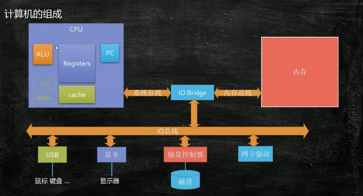
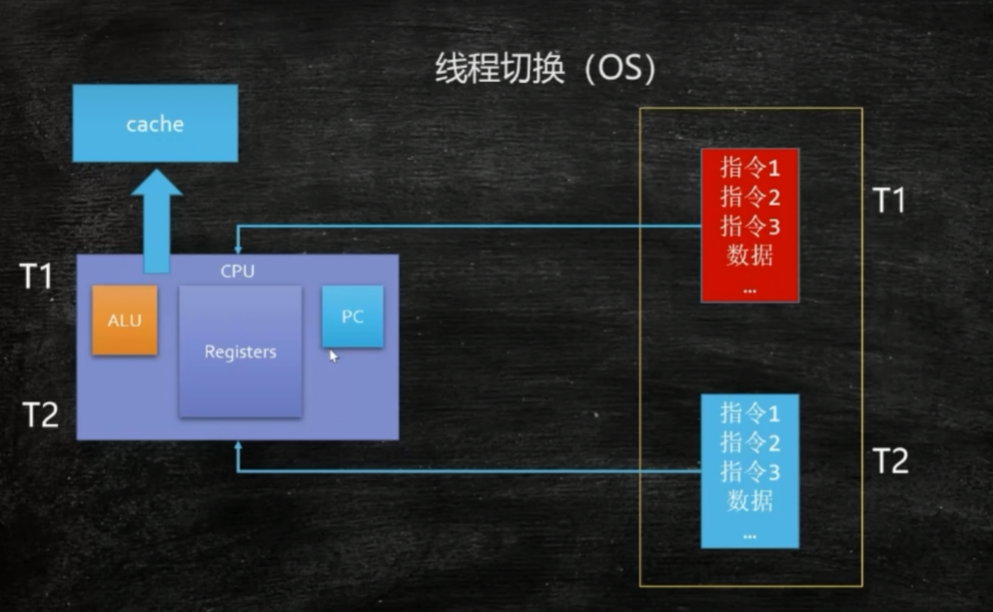
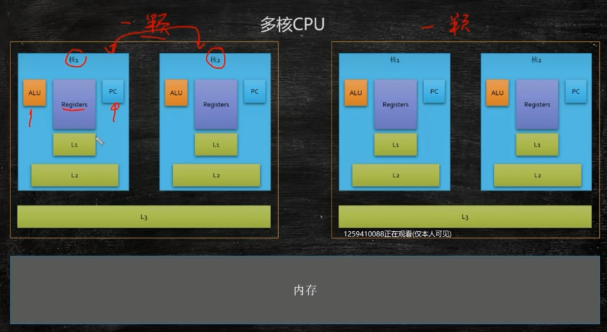
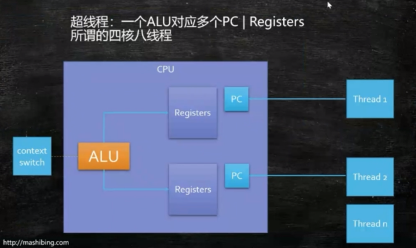

## CPU
    ALU:算术逻辑单元——用作计算——用加法器实现
    Registers:寄存器——存储数字
    PC:程序计数器——记录指令

## 程序
一个程序读入内存，全是0和1构成
从内存读入到cpu，这时候要通过总线
如何区分一段01代码是数据还是指令？——总线
总线分三种：控制总线，地址总线，数据总线

一个程序的执行，首先把可执行文件放入内存，找到起始（main）地址，逐步读出指令和数据，写回到内存

## 进程与线程
程序进入内存，被称之为进程
同一个进程内部，有多个任务并发执行的需求，可不可以使用多进程—
    能，但是最大的问题是可以通过一个进程访问另一个进程，不安全

线程——共享空间，不共享计算

进程是静态的概念：程序进入内存，分配对应资源，同时产生一个主线程
线程是动态的概念：是可执行的计算单元

一个ALU同一时间只能执行一个线程，同一段代码为什么可以被多个线程执行？————**线程切换**

## 线程切换

切换时保存上下文，保存现场

## 缓存
cpu速度和内存速度目前大概是100:1
这里的速度是ALU访问寄存器的速度比访问内存的速度快100倍
为了充分利用cpu的计算能力，在cpu和内存中引用缓存的概念

工业实践中，多采用三级缓存架构（L1,L2,L3）

超线程：一个ALU对应对个Register和PC，比如四核八线程（正常是四核四线程）

