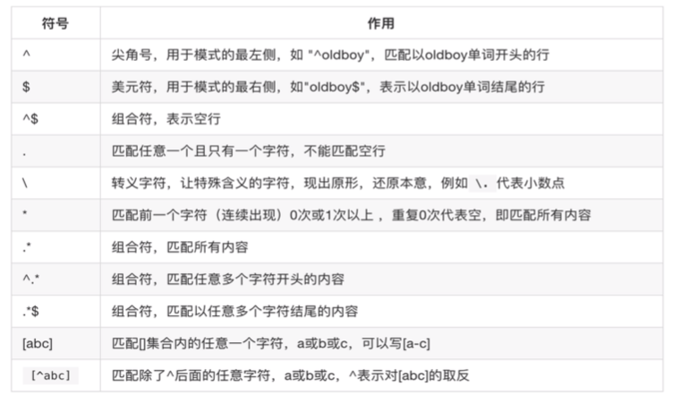
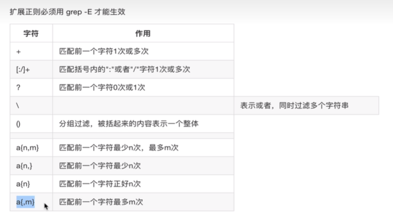

## bash
## bash是什么
bash是一个命令行处理器，在运行中文本窗口，并能执行用户直接输入的命令
bash还能从文件中读取linux命令，称之为脚本
bash支持通配符，管道，命令替换，条件判断等逻辑控制语句

## 命令行展开
'''
peng@peng-virtual-machine:/home/code$ echo {tom,bob,jerry}
tom bob jerry
peng@peng-virtual-machine:/home/code$ echo {666,888}
666 888
peng@peng-virtual-machine:/home/code$ echo change{1..5}
change1 change2 change3 change4 change5
peng@peng-virtual-machine:/home/code$ echo change{1..10..2}
change1 change3 change5 change7 change9

'''

## 命令别名
alias, unalias

## 命令历史
history
!行号 查看该行号的内容
!! 查看上一次的命令

## 快捷键
ctrl + a 移动到行首
ctrl + e 移动到行尾
ctrl + u 删除光标之前的字符
ctrl + k 删除光标之后的字符
ctrl + l 清屏，等同于clear

## 正则表达式：Regular Expression,REGEXP
分两类：
    基本正则表达式：BRE
        对应字符^$.[]*
    扩展正则表达式：ERE
        对应字符(){}?+|

基本正则表达式  

扩展正则表达式

linux仅接受三剑客（sed,awk,grep）支持，其他命令无法使用

linux三剑客
    grep: 文本过滤工具
    sed: 流编辑器，文本编辑工具
    awk: 文本报告生成器（格式化文本）
